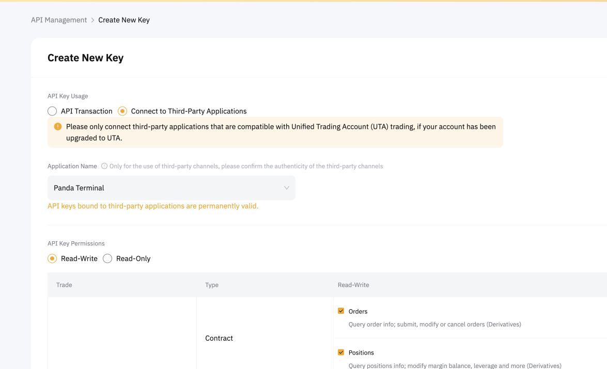

# Getting Started

Welcome to the official documentation for JLabs OEMS.  [jlabs.pandaterminal.com](https://jlabs.pandaterminal.com/).

## Setting up your account

API from external exchange(e.g. Bybit) will enable you to interact with our exchange remotely and it will provide real-time price and support direct execution of trade.

You need to have a registered account on such external exchange in order to start using JLabs Digital OEMS. For the most optimised OEMS experience, we encourage you to sign up under JLabs Digital affiliation for external exchanges.

### Bybit

#### New Bybit Users

If you don't have a Bybit account please create one using [bybit.com](https://partner.bybit.com/b/14402)

#### Registered Bybit Users

**1. Affiliate not linked to account.**

If you have no affiliate linked to your account right now. You need to submit a UID Transfer request. Typically takes upto 24-48hrs.

Submit your request using this link **[bybit/submit-request.com](https://www.bybit.com/en/help-center/s/webform?state=421)**.

Request: 

I agree to add the affiliate code to my account.  
The email address or mobile number used when registering with Bybit: 
Bybit account UID:  
Affiliate code: **AID 14402**

**2. Affiliate already linked to account.**

You need to transfer your existing identity. Bybit supports only single KYC per account. In order to make this change faster, please follow the steps below :

1. Create a new bybit acc using a new email with our affiliate link. Click here to register [bybit/submit-request.com](https://www.bybit.com/en/help-center/s/webform?state=421).
2. Use the procedure mentioned in no current affiliation to move your KYC to it.

## Setting up your API

The first thing you need to when you log into your JLabs account is adding API Keys to your account. Here's a quick step-by-step guide on how to get started with JLabs OEMS.

We support the following exchanges as of now

### Bybit

**1. Go to Bybit**

Log in or create a new account at [bybit.com](https://partner.bybit.com/b/14402).

**2. Go to API Dashboard**

Follow the link to your Account [API Management Page](https://www.bybit.com/app/user/api-management).

**3. Click Create New Key**

Note: You must enable 2FA to be able to add API keys

**4. Choose the System-genetated API Keys**

**5. Select API Transaction, input your desired API Key name (e.g. Jarvis)**

Note: Please check off Read-Write, and no IP restriction as shown in the image below.

Select all fields apart from the NFT product

**6. Enter your 2FA code and confirm. Copy your API Key and Secret Key**

**7. Head over to your account on JLabs OEMS API Page and Add the new API Key**

**8. Hit Submit, and your API is sucessfully setup!**

Note : Don't forget to create a reminder on your calendar for the date of expiration (3months from date of creation) of your API Key, so that you can create a new one a few days prior to the expiration.

**8. Go ahead and select your suitable stub (API) that you just created. Now You are all Set and Ready to make Profits with Us!**

